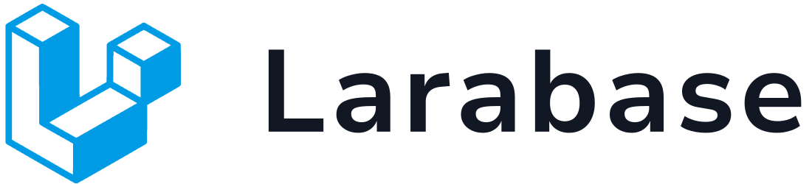

<br />
<div align="center">
  <a href="#">
    
  </a>
</div>

&nbsp;

## Built With


## Prerequisites

* PHP ^8.3

## Introduction

A Laravel template to get you started with new projects, it includes a beautiful responsive UI and
basic functionalities such as complete authentication methods, users, roles and permissions.

## Installation

1. Download or clone the repository
    ```
    git clone git@github.com:chrisquices/genesis.git
    ```

1. Create your environment file
   ```
   cp .env.example .env
   ```

1. Generate project key
   ```
   php artisan key:generate
   ```

1. Configure your environment file
    ```
    APP_NAME=
    APP_URL=
   
    DB_CONNECTION=
    DB_HOST=
    DB_PORT=
    DB_DATABASE=
    DB_USERNAME=
    DB_PASSWORD=
    ```

1. Install packages
   ```
   composer install
   npm install
   ```
   
1. Create storage folder link
   ```
   php artisan storage:link
   ```

1. Run migrations
   ```
   php artisan migrate:fresh --seed
   ```

1. Run npm run dev
    ```
    npm run dev
    ```
   
1. Run your local server
